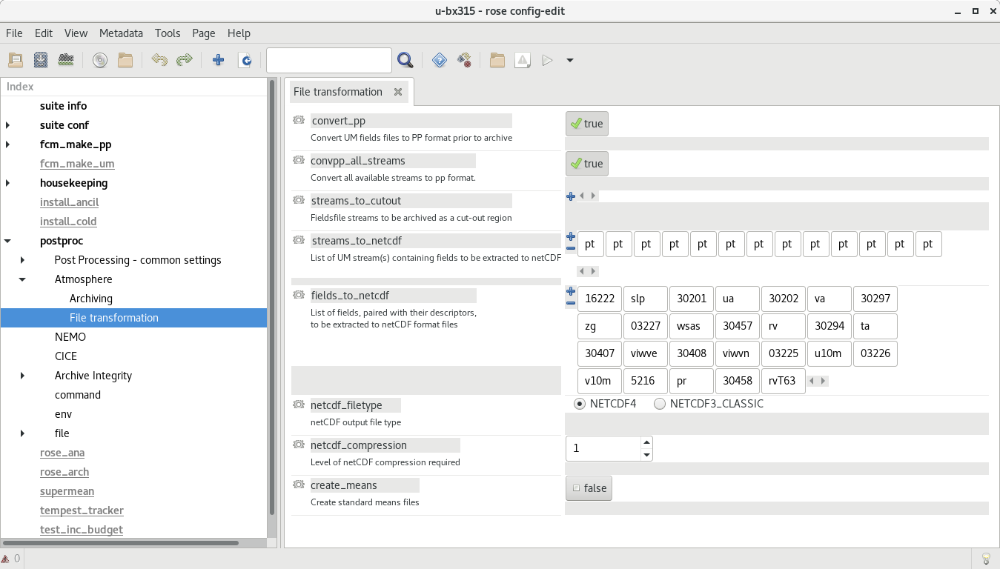
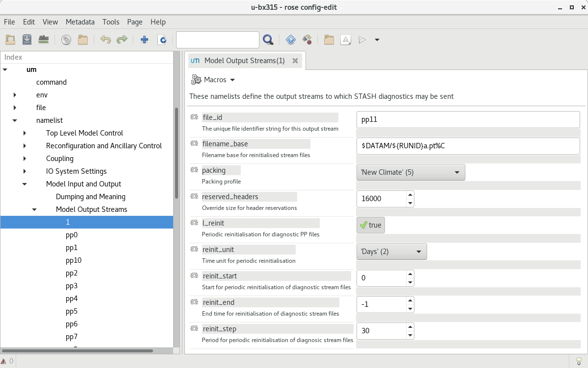
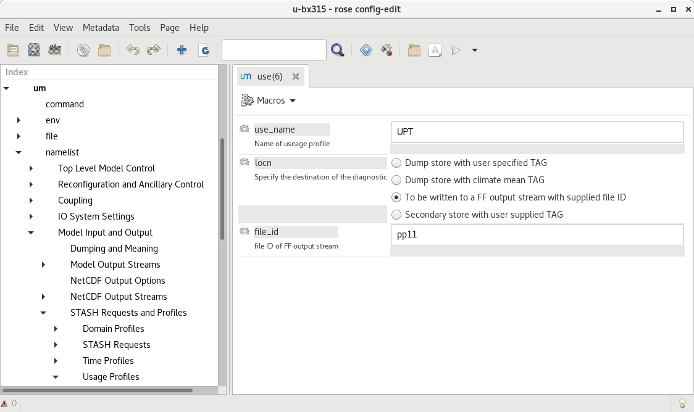

Interfaces
==========

In summary, the interfaces within inline_model_storms are:

+------------------+------------------------------------------------------+
| Name             | Description                                          |
+==================+======================================================+
| Preprocessing    | Transform the input data files to a standard format  |
|                  | for use by the inline storms code                    |
+------------------+------------------------------------------------------+
| Cyclone tracking | Use preprocessed input and produce cyclone tracks    |
+------------------+------------------------------------------------------+
| AR tracking      | Produce atmospheric river regions                    |
+------------------+------------------------------------------------------+
| Other inline     | e.g. frontal identification, MCS tracking etc        |
| metrics          |                                                      |
+------------------+------------------------------------------------------+
| Postprocessing   | Take the output files and process in required ways,  |
|                  | for example to compress files, produce annual files  |
|                  | send to storage, etc                                 |
+------------------+------------------------------------------------------+

Typically there is a separate python script within the tempest_get_data/file app to
retrieve the original data from whereever, and prepare it sufficiently for input to
the preprocessing task.

Input Files
###########

The inline model metrics code requires netCDF files as input to the preprocessing task. These input files can be sourced from wherever the user requires - e.g. model output, reanalysis etc. Currently the um_preprocess task is configured to transform output from the UM (as below) to the standardised format for the inline codes. Other preprocess tasks can/will be developed for alternative inputs (e.g. reanalysis, other climate models, etc).

Input Files from Unified Model (UM)
###################################

These are currently being produced by the UM's postproc task. The form that these files take is defined by the UM's postproc code, and take the form defined in the `INPUT_FILE_PATTERN` input variable pattern::

  INPUT_FILE_PATTERN="{runid}a.{stream}{date_start}_{variable}.nc"

The following images show how these have been
configured in `rose edit`. Example namelists to add to Rose configuration files
will be added to this repository in the future.

In the Model Output Streams then the `reinit_step` value of the netCDF stream
must equal the resubmission period `EXPT_RESUB` defined in `rose-app.conf` so
that the netCDF files are available to the tracking task when the subsequent
postproc task has completed.

.. image:: images/stash_requests.png

In this configuration, files are saved in the `$DIR_OUT` directory, with additional subdirectories for the model (suite) name and data frequency.

The str names of these files must correspond to those of the `[tc/ar]_variables_input` in the `rose-app.conf` for the different tracking schemes, which should be a subset of the `VARIABLES_RENAME` list in the `rose-suite.conf` file.

The path that the tracking uses to read these files is configured in the
`input_directory` value in `rose-app.conf`, which is `$DIR_OUT/$SUITEID_OVERRIDE/$DATA_FREQ_STRING`.

The input netCDF files are not currently archived, but can be deleted after the processing
has been run via logical `DELETE_SOURCE` value in the `rose-suite.conf`.

Environment Variables
#####################

The Python code requires the following environment variables to be set, some calculated by the suite and some set in rose-suite.conf.

These are generated by the suite cycling:

+----------------------------+------------------------------------------------------------+
| Name                       | Description                                                |
+============================+============================================================+
| BASIS                      | The basis (original/start) time                            |
+----------------------------+------------------------------------------------------------+
| CYLC_TASK_CYCLE_TIME       | The Cylc task cycle (current data) time                    |
+----------------------------+------------------------------------------------------------+
| CYLC_TASK_PARAM_suitename  | same as suitename, enables multiple names to be used       |
+----------------------------+------------------------------------------------------------+
| CYCLEPERIOD                | Cycling period (e.g. 1M)                                   |
+----------------------------+------------------------------------------------------------+
| DIR_OUT_RESOL=$DIR_OUT/$CYLC_TASK_PARAM_suitename/{{DATA_FREQ_STRING}}/tempest_tracking |
|                            | Output path for given resolution for data used for tracking|
+----------------------------+------------------------------------------------------------+
| ENDDATE                    | The end date for this cycle                                |
+----------------------------+------------------------------------------------------------+
| IS_LAST_CYCLE              | Logical, is this the last cycle of the simulation          |
+----------------------------+------------------------------------------------------------+
| LASTCYCLE                  | The date for the last cycle                                |
+----------------------------+------------------------------------------------------------+
| NEXT_CYCLE                 | The next cylc CYCLE time                                   |
+----------------------------+------------------------------------------------------------+
| PREVIOUS_CYCLE             | The previous cylc CYCLE time                               |
+----------------------------+------------------------------------------------------------+
| STARTDATE                  | The start date for this cycle                              |
+----------------------------+------------------------------------------------------------+
| suitename                  | SUITE_OVERRIDE, suite name for data to use                 |
+----------------------------+------------------------------------------------------------+
| TIME_CYCLE                 | The current cylc CYCLE time YYYYMMDDHHTXXXX                |
+----------------------------+------------------------------------------------------------+
| TM2_CYCLE                  | The previous cycle but one                                 |
+----------------------------+------------------------------------------------------------+
| TP2_CYCLE                  | The cycle after next                                       |
+----------------------------+------------------------------------------------------------+

These are defined in the rose-suite.conf, with example values:

+----------------------------+------------------------------------------------------------+
| Name                       | Description                                                |
+============================+============================================================+
| AFTERBURNER_HOME_DIR       |'/data/users/afterburner/software/turbofan/v1.3.3'          |
|                            | Path to the Afterburner code to "run" the configuration    |
+----------------------------+------------------------------------------------------------+
| BACKUP_DIR='/data/users/$USER/tracking/syclops'
|                      | Path to the backup directory if MASS is not used or not available|
+----------------------------+------------------------------------------------------------+
| CDO_CONDA_PATH='/home/h06/hadom/.conda/envs/cdo'                                        |
|                      | Path to CDO installation as some cdo commands are used           |
+----------------------------+------------------------------------------------------------+
| DATAM='History_Data' | Not used                                                         |      
+----------------------------+------------------------------------------------------------+
| DATA_FREQ_STRING='6h'| The frequency of the input data (3h, 6h typically used)          |
+----------------------------+------------------------------------------------------------+
| DELETE_PROCESSED=True| Logical to delete the processed input data when no longer needed |
+----------------------------+------------------------------------------------------------+ 
| DELETE_SOURCE=True   | Logical to delete source data when no longer needed              |
+----------------------------+------------------------------------------------------------+
| DIR_OUT='/scratch/$USER/syclops_tracking'                                               |
|                      | The output base directory path
+----------------------------+------------------------------------------------------------+
| EXPT_BASIS='18510101T0000Z'                                                             |
|                      | The start date for the tracking                                  |
+----------------------------+------------------------------------------------------------+ 
| EXPT_CALENDAR='360day'                                                                  |
|                      | Calendar for cycling mode (not related to data calendar)         |
+----------------------------+------------------------------------------------------------+
| EXPT_HORIZ_ATM='n96e'| The resolution of the data (name also needs to match the         |
|                      | orography file                                                   |
+----------------------------+------------------------------------------------------------+
| EXPT_RESUB='P1M'     | The cycling frequency (chunks of data are assumed to be retrieved|
|                      | at this frequency)                                               |
+----------------------------+------------------------------------------------------------+
| EXPT_RUNLEN='P20Y0M' | Period of time to run tracking for                               |
+----------------------------+------------------------------------------------------------+
| FILE_PATTERN_PROCESSED="{variable}_{frequency}_{runid}_{date_start}-{date_end}.nc"      |
|                      | The file naming pattern for the processed files used as input to |
|                      | TempestExtremes                                                  |
+----------------------------+------------------------------------------------------------+
| FRONTAL_DIR='/data/users/hadom/branches/git/front_id_private'                           |
|                      | Path to the frontal detection code                               |
+----------------------------+------------------------------------------------------------+
| INLINE_MODEL_STORMS_PATH='/data/users/hadom/branches/git/inline_model_storms'           |
|                      | Path to the code for the storm tracking                          |
+----------------------------+------------------------------------------------------------+
| INLINE_TRACKING=false| Logical, for tracking within a model suite rather than separately|
+----------------------------+------------------------------------------------------------+
| INPUT_DATA_FROM_MASS=true                                                               |
|                      | Logical, original data will come from the MASS archive (turns on |
|                      | app to retrieve data                                             |
+----------------------------+------------------------------------------------------------+
| INPUT_FILE_PATTERN="{runid}a.{stream}{date_start}_{variable}.nc"                        |
|                      | File naming pattern for input data (from MASS or elsewhere,      |
|                      |converted to netcdf                                               |
+----------------------------+------------------------------------------------------------+
| LAT_VAR='latitude'   | Name of latitude coordinate in input files to TempestExtremes    |
+----------------------------+------------------------------------------------------------+
| LON_VAR='longitude'  | Name of longitude coordinate in input files to TempestExtremes   |
+----------------------------+------------------------------------------------------------+
| METO_MOOSE_PROJECT_USE=false                                                            |
|                      | Not used currently                                               |
+----------------------------+------------------------------------------------------------+
| OROGRAPHY_DIR='/cray_hpc/data_xcs/d05/hadom/tempest_extremes_datafiles'                 |
|                      | Path to orography data files                                     |
+----------------------------+------------------------------------------------------------+
| R_LIBRARIES='/home/h06/hadom/R/x86_64-pc-linux-gnu-library/3.6'                         |
|                      | Path to R libraries for frontal detection code                   |
+----------------------------+------------------------------------------------------------+
| REGRID_RESOLUTIONS=["native"]                                                           |
|                      | List, resolutions to do tracking on, anything other than native  |
|                      | will cause regridding (currently other resolutions defined as    | 
|                      | nxxe and string found in orography directory                     |
+----------------------------+------------------------------------------------------------+
| ROTATED=False        | not used                                                         |
+----------------------------+------------------------------------------------------------+
| RUNID=true           | Not used, leave as true                                          |
+----------------------------+------------------------------------------------------------+
| SCITOOLS_MODULE='scitools/production-os46-3'                                            |
|                      | Environment module to use for iris etc                           |
+----------------------------+------------------------------------------------------------+
| SITE='meto_spice'    | Location used in site/ for resources, queues etc                 |
+----------------------------+------------------------------------------------------------+
| SUITEID_OVERRIDE='u-cy163'                                                              |
|                      | Suite name for input data                                        |
+----------------------------+------------------------------------------------------------+
| TASK_ARCH_LOG=true   | Archive cyc log files                                            |
+----------------------------+------------------------------------------------------------+
| TASK_ID_FRONT=true   | Logical flag do frontal detection                                |
+----------------------------+------------------------------------------------------------+
| TASK_RUN=false       | Not used                                                         |
+----------------------------+------------------------------------------------------------+
| TASK_TE_AR=true      | Logical flag to do atmospheric river detection                   |
+----------------------------+------------------------------------------------------------+
| TASK_TE_CYCLONE=true | Logical flag to do cyclone detection                             |
+----------------------------+------------------------------------------------------------+
| TEMPEST_DIR='/data/users/hadom/branches/git/tempestextremes_v2.2.2/bin'                 |
|                      | Path to TempestExtremes code binaries                            |
+----------------------------+------------------------------------------------------------+
| TEMPEST_HELPER_PATH='/home/h03/ucc/software/tempest_helper'                             |
|                      | Path to helper scripts                                           |
+----------------------------+------------------------------------------------------------+
| TRACK_BY_YEAR=True   | Track each year of data (Dec[year-1] to end Dec[current year],   |
|                      | i.e. 13 months if possible, so that tracks across the New Year   |
|                      | can be included. Code exists to stitch years together afterwards |
+----------------------------+------------------------------------------------------------+
| TRACK_AT_END=False   | Run tracking at end of time period, i.e. over whole period       |
|                      | Warning: can be a lot of data, and take a lot of time            |
+----------------------------+------------------------------------------------------------+
| UM_ARCHIVE_TO_MASS=True                                                                 |
|                      | Archive the outputs from the tracking to MASS (if not possible,  |
|                      | copied to BACKUP_DIR instead                                     |
+----------------------------+------------------------------------------------------------+
| VARIABLES_INPUT=["psl", "uas", "vas", ...etc]                                           |
|                      | List of variables in input datasets required                     | 
+----------------------------+------------------------------------------------------------+
| VARIABLES_RENAME=["psl", "uas", "vas", ...etc]                                          |
|                      | Variables produced from preprocessing, names as used in          |
|                      | TemestExtremes namelists, order corresponds to VARIABLES_INPUT   |
+----------------------------+------------------------------------------------------------+
| MPLBACKEND=Agg       | The matplotlib backend (when DISPLAY is not defined)             |
+----------------------------+------------------------------------------------------------+
| NCODIR               | The directory path to nco                                        |
+----------------------------+------------------------------------------------------------+

In the default configuration, the following environment variable is used in
`rose-app.conf` and needs to be set by the suite (which happens by default in
standard UM suites):

+----------------------+------------------------------------------------------+
| Name                 | Description                                          |
+======================+======================================================+
| DATAM                | The data output working directory (not used here)    |
+----------------------+------------------------------------------------------+

Input variables in `common`
###########################

These variables are for the cyclone tracking app `tempest_tracker`, for variables 
not defined by the environment above:

+--------------------------+--------------------------------------------------------+
| Name                     | Description                                            |
+==========================+========================================================+
| detectblobs_vars=["vorcyc_850", "ua_925", "va_925"]                               |
|                          | Variables needed by the detectblobs step               |
+--------------------------+--------------------------------------------------------+
| in_fmt_stitch_default1   | The default1 variables (and names) input to the        |
|                          | stitch step. Using a default means that the same       |
|                          | string is not needed multiple time in the namelists.   |
|                          | Note these are hardwired to be recognised by the code  |
+--------------------------+--------------------------------------------------------+
| in_fmt_stitch_default2   | The default2 variables (and names) input to the        |
|                          | stitch step                                            |
+--------------------------+--------------------------------------------------------+
| in_fmt_noedit_default3   | The default3 variables (and names) input to the        |
|                          | nodeedit step                                          |
+--------------------------+--------------------------------------------------------+
| in_fmt_noedit_default4   | The default4 variables (and names) input to the        |
|                          | nodeedit step                                          |
+--------------------------+--------------------------------------------------------+
| input_directory          | Not used                                               |
+--------------------------+--------------------------------------------------------+
| nodeedit_vars            | Variables to be used in nodeedit                       |
+--------------------------+--------------------------------------------------------+
| out_fmt_nodeedit_default3| The default3 variables (and names) output from the     |
|                          | nodeedit step                                          |
+--------------------------+--------------------------------------------------------+
| outputcmd_detect_default1| Default1 command for output from DetectNodes           |
+--------------------------+--------------------------------------------------------+
| outputcmd_detect_default2| Default2 command for output from DetectNodes           |
+--------------------------+--------------------------------------------------------+
| plot_tracks              | True/False to plot tracks as png file                  |
+--------------------------+--------------------------------------------------------+
| tc_detect_script         | Location of DetectNodes executable                     |   
+--------------------------+--------------------------------------------------------+
| tc_stitch_script         | Location of StitchNodes executable                     |
+--------------------------+--------------------------------------------------------+
| tc_editor_script         | Location of NodeFileEditor executable                  |
+--------------------------+--------------------------------------------------------+
| tc_varproc_script        | Location of VariableProcessor executable               |
+--------------------------+--------------------------------------------------------+
| tc_detectblobs_script    | Location of DetectBlobs executable                     |
+--------------------------+--------------------------------------------------------+
| tc_blobstats_script      | Location of BlobStats executable                       |
+--------------------------+--------------------------------------------------------+
| tc_stitchblobs_script    | Location of StitctBlobs executable                     |
+--------------------------+--------------------------------------------------------+
| tc_variables             | [""] List. Names of processed variables used by        |
|                          | TempestExtremes cyclone tracking. Is a subset of       |
|                          | $VARIABLES_RENAME                                      |
+--------------------------+--------------------------------------------------------+
| track_types              | [""] List. Keys to the parameter input namelists, to   |
|                          | different types of cyclone tracking                    |
+--------------------------+--------------------------------------------------------+
| varproc1_vars            | Variables for proc1 of the VariableProcessor input     |
+--------------------------+--------------------------------------------------------+
| varproc2_vars            | Variables for proc2 of the VariableProcessor input     |
+--------------------------+--------------------------------------------------------+

Preprocessing Input Files
#########################

The input netCDF files require various transformations before the inline metrics
can use them. The preprocessing performs these transformations and saves
the resulting files in the output directory. The filenames of these generated files is defined in the variable `file_pattern_processed` to be in the form::

   {variable}_{frequency}_{runid}_{date_start}-{date_end}

The variables to be produced in this way, and renamed, are defined in two input variables::

  VARIABLES_INPUT

  VARIABLES_RENAME

The variable names in `variables_rename` will be inserted into the processed netcdf files, and hence be standardised for the inline model metrics code.

The intermediate netCDF files are not currently archived, and can be deleted after the processing has been run via the logical `delete_processed` value in the `rose-suite.conf`.

Tracking on regridded model grids
#################################

The input netCDF files may also be regridded to specified UM grids defined by `regrid_resolutions` defined in `rose-app.conf`. If this is not `None`, then as well as the tracking being done on the native grid that the model is using, an additional set of tracking will be performed on the grid specified. `regrid_resolutions` takes the form of a list `['N96']`. The resolution string must exist as an orography file (see below under Orography Files), using that grid for the regridding.

Output Files
############

The path to the output files is specified by `DIR_OUT_RESOL` in the suite.
The following files are generated from tempest_cyclone in the `tempest_tracking_{resol}` 
subdirectory. The data_frequency in the file names comes from any timefilter setting in 
the namelist commands, else defaults to the data_frequency value.

If archiving is selected, all the detect, detectblobs and track, tracknodeedit, trackblobs, blobstats
files will be archived. In particular with all the detect files, one can fairly simply rerun the 
tracking by retrieving these files from the archive and running the tracking on them offline.

Tracking occurs at the end of each year, and/or over all files available, depending on choices.

+---------------------------------------------------------+---------------------------------------------------------------------------------+
| Name                                                    | Description                                                                     |
+=========================================================+=================================================================================+
| {runid}_detect_{time_start}-{time_end}_{data_frequency}_{track_type}.txt               | The file generated by the TempestExtremes DetectNodes command                   |
+---------------------------------------------------------+---------------------------------------------------------------------------------+
| {runid}_detectblobs_{time_start}-{time_end}_{data_frequency}_{track_type}.txt               | The file generated by the TempestExtremes DetectBlobs command              |
+---------------------------------------------------------+---------------------------------------------------------------------------------+
| {runid}_track_{time_start}-{time_end}_{data_frequency}_{track_type}.{csv,gfdl}             | The tracked file generated by the TempestExtremes StitchNodes. The format can be csv, gfdl                     |
+---------------------------------------------------------+---------------------------------------------------------------------------------+
| {runid}_track_{time_start}-{time_end}_{data_frequency}_{track_type}_nogaps.{csv,nc}             | The tracked file generated by the TempestExtremes StitchNodes and converted to netcdf. The format can be csv, nc. Here any gaps in the storms have been linearly filled in                |
+---------------------------------------------------------+---------------------------------------------------------------------------------+
| {runid}_tracknodeedit_{time_start}-{time_end}_{data_frequency}_{track_type}.csv             | The tracked file generated by the TempestExtremes StitchNodes and processed by NodeFileEditor. The format can be csv.      |
+---------------------------------------------------------+---------------------------------------------------------------------------------+
| {runid}_tracknodeedit_{time_start}-{time_end}_{data_frequency}_{track_type}.{csv,nc}             | The tracked file generated by the TempestExtremes StitchNodes and processed by NodeFileEditor. The format can be csv, gfdl. Here any gaps in the storms have been linearly filled in                    |
+---------------------------------------------------------+---------------------------------------------------------------------------------+
| {runid}_trackblobs_{time_start}-{time_end}_{data_frequency}_{track_type}.nc             | The tracked file generated by the TempestExtremes StitchBlobs. The format can be nc.                   |
+---------------------------------------------------------+---------------------------------------------------------------------------------+
| {runid}_blobstats_{time_start}-{time_end}_{data_frequency}_{track_type}.txt             | The generated by the TempestExtremes BlobStats. The format can be txt.                   |
+---------------------------------------------------------+---------------------------------------------------------------------------------+

The following files are generated from tempest_atmosriver:

+---------------------------------------------------------+---------------------------------------------------------------------------------+
| Name                                                    | Description                                                                     |
+=========================================================+=================================================================================+
| {runid}_ARmask_{time}_{ar_type}.txt                     | The atmospheric river mask file generated by the TempestExtremes AR detection   |
+-------------------------------------------------------------------------------------------------------------------------------------------+

The output files are not currently archived after the processing has been run.

Orography Files
###############

An orography file for each grid being tracked should be placed in the directory
specified by the `orography_dir` value in `rose-suite.conf`. The file to use is
identified from the number of longitude  points in the the input files and is
specified using the standard UM N grid name (and defined by `EXPT_HORIZ_ATM` in 
rose-suite.conf. The orography files should have a
name in the form::

    orography-<n-code>e.nc

For example a file with 512 longitude points is on the `N216` grid and will be
called::

    orography-n216e.nc

The orography file can be used within the tracking codes to check that storms are over 
the ocean/land for min/max durations.

Track types
###########

The list `track_types` in `rose-app.conf` is the selection of identification/tracking 
recipies to be used, with details of each contained in the `rose-app.conf`.
Similarly the list `ar_types` is the selection of atmospheric river recipies.

Variables output
################

The variables output by the cyclone tracking (in csv/gfdl and netCDF file if specified) 
are specified by the command in the `track_types`, either the corresponding `_stitch` or 
`_profile` if the latter exists. These arguments contain an `out_fmt` component, which 
details all the output variables. The tracking code will interpret this string of variables, 
and use them as variable names in the netCDF file. 

Other cyclone tracking variables
################################

The variable list specified in the `out_fmt` command mentioned above can be long and repetitive across different `track_types`. To help with this, standard template values for `in_fmt` and `out_fmt` can be provided in the `[common]` part of the cyclone tracking `rose-app.conf` file. Specifically:

* `output_detect_default` can be defined in `[common]`, and used for the output from the detect command;

* `in_fmt_stitch_default` can be defined in `[common]`, and then used at the `in_fmt` argument for _stitch and _profile;

* `out_fmt_profile1` and `out_fmt_profile2` can be used in `[common]` for the `out_fmt` of the _profile step.

Note that these need to be consistent with each other, as the code is unable to check that the output from one command is consistent with the input to the next command.

