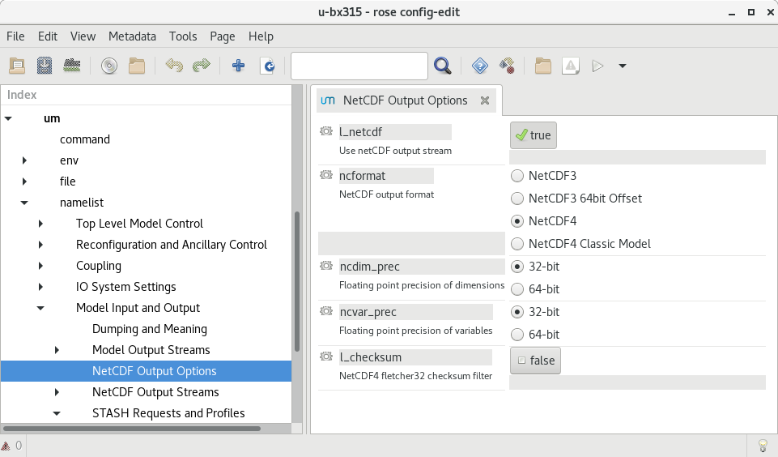
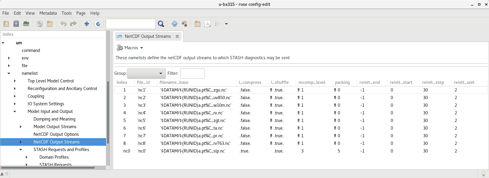
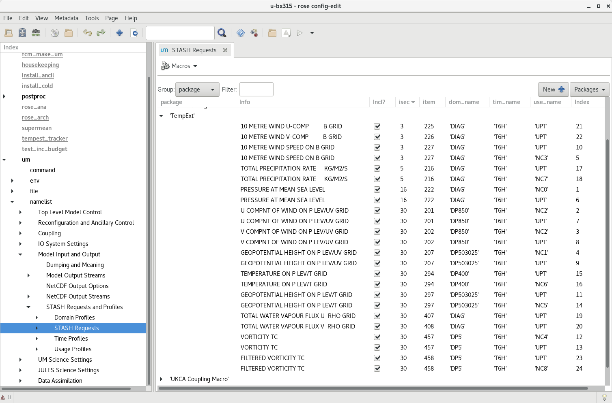

Interfaces
==========

Input Files
###########

The tracking requires netCDF files. These are currently being produced by direct
netCDF output from the UM. The following images show how these have been
configured in `rose edit`. Example namelists to add to Rose configuration files
will be added to this repository in the future.

In this configuration, files are saved in the `$DATAM` directory.

The path that the tracking uses to read these files is configured in the
`input_directory` value in `rose-app.conf`.

The input netCDF files are not currently archived or deleted after the processing
has been run.

Environment Variables
#####################

The Python code requires the following environment variables to be set:

+----------------------+------------------------------------------------------+
| Name                 | Description                                          |
+======================+======================================================+
| CYLC_TASK_CYCLE_TIME | The Cylc task cycle time                             |
+----------------------+------------------------------------------------------+
| RUNID                | The UM RUNID                                         |
+----------------------+------------------------------------------------------+

In the default configuration, the following environment variable is used in
`rose-app.conf` and needs to be set by the suite (which happens by default in
standard UM suites):

+----------------------+------------------------------------------------------+
| Name                 | Description                                          |
+======================+======================================================+
| DATAM                | The data output working directory                    |
+----------------------+------------------------------------------------------+

Intermediate Files
##################

The input netCDF files require various transformations before TempestExtremes
can track them. The tracking software performs these transformations and saves
the resulting files in the output directory. The filename of these generated
files is currently hardcoded in the software to be in the form::

   atmos_{runid}a_{frequency}h_{time_range}_pt-{variable_name}.nc

The intermediate
netCDF files are not currently archived or deleted after the processing has been run.

Output Files
############

The path to the output files if specified by `output_directory` in `rose-app.conf`.
The following files are generated:

+----------------------------------------------+---------------------------------------------------------------+
| Name                                         | Description                                                   |
+==============================================+===============================================================+
| candidate_file_{time_range}_{track_type}.txt | The candidate file generated by the TempestExtremes detection |
+----------------------------------------------+---------------------------------------------------------------+
| track_file_{time_range}_{track_type}.txt     | The tracked file generated by the TempestExtremes stitching   |
+----------------------------------------------+---------------------------------------------------------------+
| track_file_{time_range}_{track_type}.png     | (Optional) The plotted tracks for the specified time period   |
+----------------------------------------------+---------------------------------------------------------------+

The output files are not currently archived after the processing has been run.